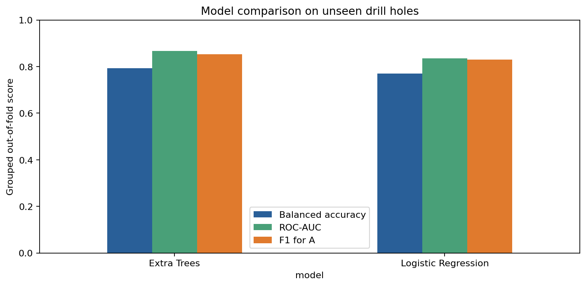
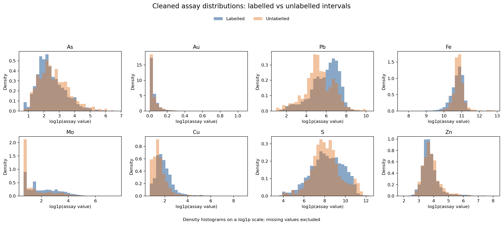
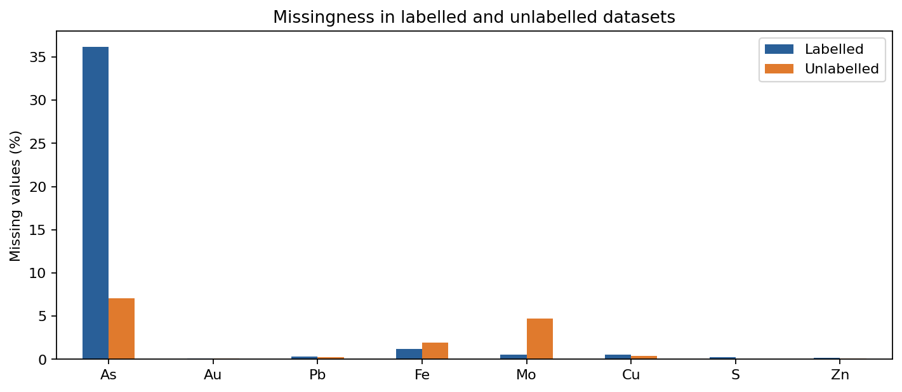
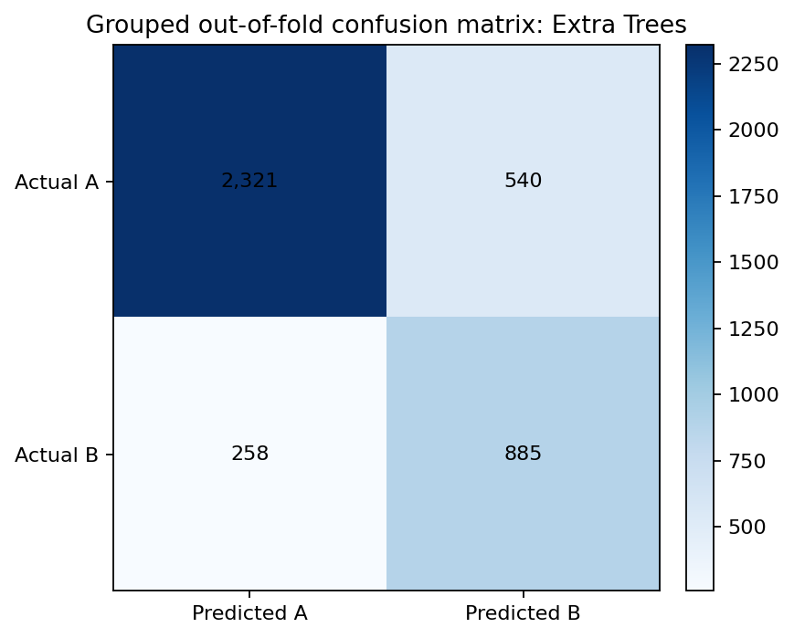
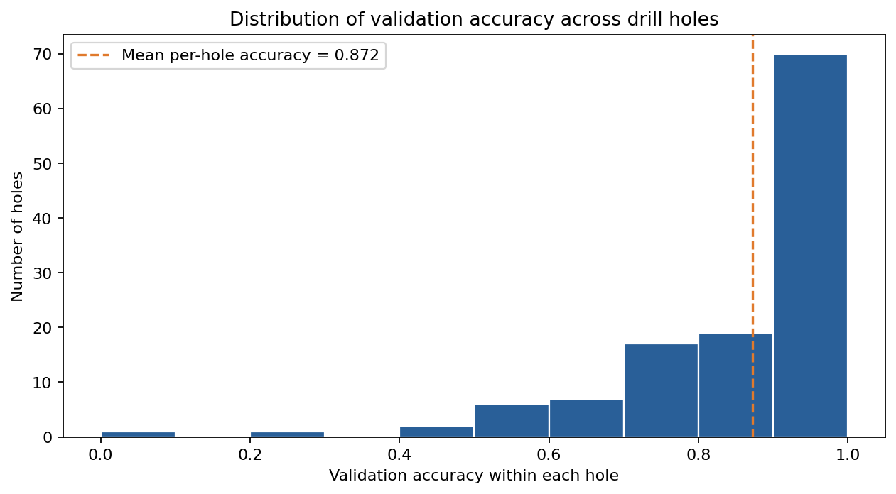
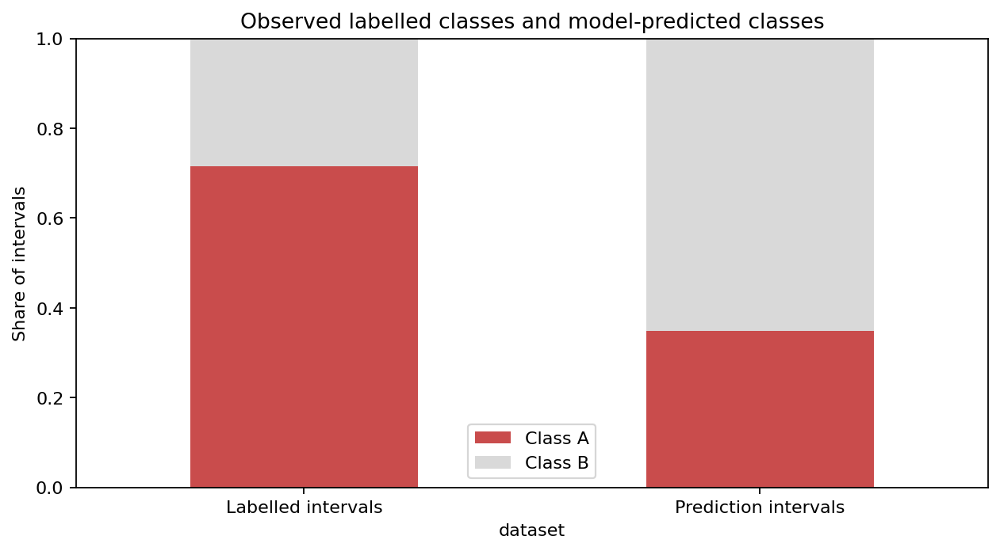
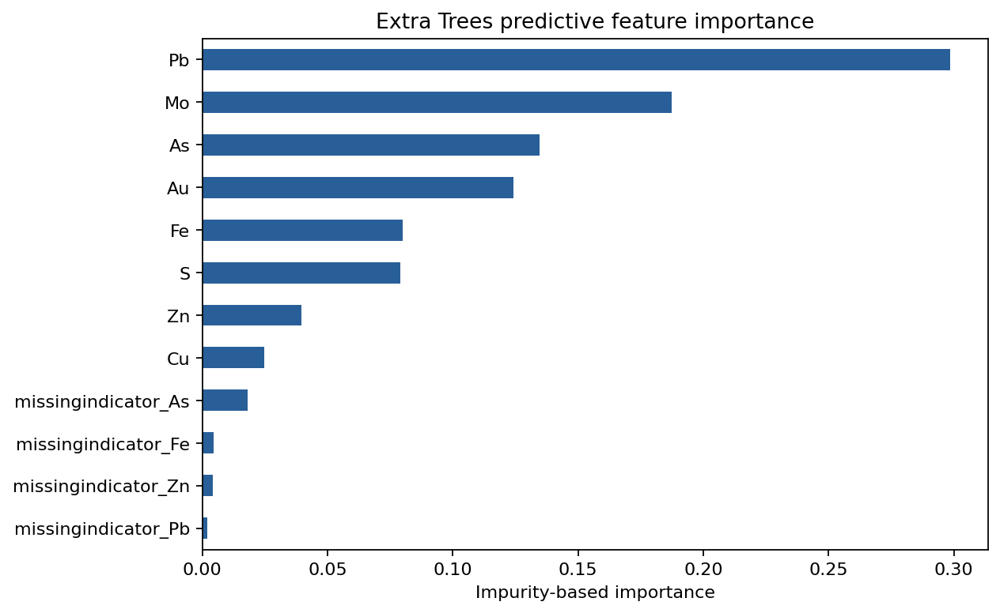

# Datarock Broken Down Lead Deposit: geochemical proximity classification

This repository is a reproducible solution to the [Solve Geosolutions / Datarock coding test](https://github.com/Solve-Geosolutions/coding-test). It uses eight geochemical assay variables—As, Au, Pb, Fe, Mo, Cu, S, and Zn—to classify drill-hole intervals as:

- **A:** proximal to the orebody
- **B:** distal from the orebody

The final model scores the 767 intervals whose original class is `?`. The main analysis and presentation deliverable is the fully executed notebook:

[`nbtk/geochem_proximity_model.ipynb`](nbtk/geochem_proximity_model.ipynb)

## Results at a glance

The final model is selected using five-fold `StratifiedGroupKFold` validation, grouped by `holeid`. Every validation hole is absent from its corresponding training fold.

| Model | Accuracy | Balanced accuracy | ROC-AUC | Precision A | Recall A | F1 A |
|---|---:|---:|---:|---:|---:|---:|
| Extra Trees | 0.801 | 0.793 | 0.867 | 0.900 | 0.811 | 0.853 |
| Logistic Regression | 0.772 | 0.770 | 0.835 | 0.892 | 0.775 | 0.829 |

Extra Trees is selected because it has the higher grouped out-of-fold balanced accuracy.



The final model produces:

| Predicted class | Intervals |
|---|---:|
| A | 267 |
| B | 500 |

The complete predictions are available at [`output/predictions.csv`](output/predictions.csv).

## Analysis boundary: evidence and domain expertise

This submission separates what the reproducible ML workflow can establish from decisions that require subject-matter knowledge.

| Area | What this workflow can establish | What requires domain expertise |
|---|---|---|
| Data quality | Quantify missingness, unusual codes, censoring and distribution differences | Confirm assay units, analytical methods, detection limits, batch effects and the meanings of `-999` and blanks |
| Predictive validation | Measure performance on drill holes excluded from model fitting | Decide whether validation and prediction holes are geologically and operationally comparable |
| Model output | Produce repeatable class predictions, scores and uncertainty flags | Set a decision threshold using the consequences of false proximal and false distal calls |
| Observed patterns | Report class, feature and downhole differences descriptively | Decide whether any pattern is geologically plausible or operationally meaningful |

The results support a predictive prototype. They do not by themselves establish geological causes, expected prevalence in future drilling or deployment readiness.

## Data understanding and QA/QC

The source contains 4,004 labelled intervals from 123 holes and 767 prediction intervals from 17 separate holes.

| Dataset | Original classes | Intervals | Drill holes |
|---|---|---:|---:|
| Labelled | A: 2,861; B: 1,143 | 4,004 | 123 |
| Prediction | `?`: 767 | 767 | 17 |

The workflow checks duplicate sample identifiers, non-positive drill intervals, blank assays, below-detection-limit strings such as `<0.005`, and the `-999` sentinel.

For this exercise, `<x` is replaced with `x / 2`, while `-999` is converted to missing. Blank and sentinel values are then handled by median imputation with missingness indicators inside each model pipeline. During cross-validation, the imputer is fitted only on the training holes; the raw source data is not overwritten.

The compact EDA below is calculated before model imputation. Raw quality counts cover the full dataset; missingness and skewness are calculated after applying the documented cleaning rules. Values reported as `<x` are censored assay results rather than missing values.

| Assay | Blank/NA | `<x` values | `-999` | Labelled missing (%) | Prediction missing (%) | Labelled skewness |
|---|---:|---:|---:|---:|---:|---:|
| As | 1,503 | 0 | 0 | 36.19 | 7.04 | 9.68 |
| Au | 6 | 464 | 0 | 0.12 | 0.13 | 7.51 |
| Pb | 15 | 0 | 0 | 0.32 | 0.26 | 9.68 |
| Fe | 62 | 0 | 0 | 1.17 | 1.96 | 3.70 |
| Mo | 30 | 0 | 28 | 0.55 | 4.69 | 25.82 |
| Cu | 25 | 0 | 0 | 0.55 | 0.39 | 49.21 |
| S | 10 | 0 | 0 | 0.25 | 0.00 | 3.93 |
| Zn | 9 | 0 | 0 | 0.20 | 0.13 | 12.78 |

All eight labelled assay variables are strongly right-skewed on their original scales. This supports median rather than mean imputation as a robust baseline, but it does not establish that median imputation is geochemically correct.



The figure compares cleaned, non-missing labelled and prediction values using density histograms on a `log1p` scale. Missingness is also compared directly between the two datasets.



These are descriptive data checks only. The treatment of censored and missing assays, and the causes and significance of dataset differences, require review by geochemistry, assay QA/QC and operational domain experts. See the [fully executed notebook](nbtk/geochem_proximity_model.ipynb), [`output/assay_eda_summary.csv`](output/assay_eda_summary.csv) and [`output/missingness_comparison.csv`](output/missingness_comparison.csv) for the complete calculations.

## Modelling workflow

### 1. Features and exclusions

The model uses only the eight assay variables. `Unique_ID`, `holeid`, `from`, and `to` are retained as metadata but excluded from the predictors. This tests predictive information in the geochemistry without introducing hole identity or interval depth as shortcuts.

### 2. Models and class imbalance

Two models are compared:

1. **Logistic Regression** provides a simple benchmark using `log1p` transformation and standardisation.
2. **Extra Trees** provides a flexible comparison that can represent nonlinear relationships and interactions without feature scaling.

Both pipelines use median imputation, missingness indicators and balanced class weights. Because Class A forms approximately 71.5% of the labelled intervals, balanced accuracy is the primary selection metric and precision and recall are reported alongside it. No rows are duplicated or removed to rebalance the classes.

Extra Trees is selected because it performs better than Logistic Regression under the same drill-hole-aware validation. Its single-worker fitting is deterministic so the generated score file is repeatable.

### 3. Drill-hole-aware validation

Adjacent intervals from one drill hole are related. A row-random split could put neighbouring intervals from the same hole in both training and validation, producing an optimistic estimate for future holes.

The workflow uses five-fold `StratifiedGroupKFold` with `holeid` as the group. Every validation hole is absent from its corresponding training fold, and the reported model comparison uses out-of-fold predictions.



### 4. Per-hole evaluation

Overall row-level metrics give larger holes more weight because they contain more intervals. The notebook therefore also calculates metrics separately for all 123 labelled holes.

- Per-hole accuracy is reported for every hole.
- Per-hole balanced accuracy and ROC-AUC are reported only for holes containing both classes.
- Mean per-hole accuracy gives each hole equal weight.
- Full results are saved to [`output/per_hole_validation.csv`](output/per_hole_validation.csv).

| Per-hole validation summary | Result |
|---|---:|
| Labelled holes evaluated | 123 |
| Mean per-hole accuracy | 0.872 |
| Median per-hole accuracy | 0.958 |
| 10th percentile per-hole accuracy | 0.659 |
| Holes containing both classes | 32 |
| Mean balanced accuracy across two-class holes | 0.715 |
| Mean ROC-AUC across two-class holes | 0.809 |

Because 91 of the 123 holes contain only one observed class, mean per-hole accuracy is not a replacement for the overall grouped balanced accuracy. The two-class-hole metrics are shown separately for that reason.



Variation across holes is presented as a validation result only. Any relationship between difficult holes and geology, sampling, assay campaigns or spatial context requires domain-expert review.

### 5. Final model and score output

The selected Extra Trees pipeline is refit on all 4,004 labelled intervals and applied to all 767 unlabelled intervals.

The output deliberately uses **score** terminology:

- `model_score_A`: uncalibrated Extra Trees score for Class A;
- `score_strength`: the larger of `model_score_A` and `1 - model_score_A`;
- `near_decision_boundary`: `True` when the score lies between 0.40 and 0.60.

These values are not presented as calibrated probabilities.

## Prediction checks and distribution shift

Class A represents approximately 71.5% of labelled intervals. The model assigns Class A to approximately 34.8% of prediction intervals, a difference of about -36.7 percentage points.



This is a descriptive comparison between known labels and model predictions. It is not interpreted as a geological trend.

Before drawing conclusions from this result, domain experts should validate:

1. whether the labelled and new holes are comparable in geological setting, drilling purpose, assay campaign, laboratory, and sampling process;
2. whether a different proximal/distal prevalence is expected in the new drilling area;
3. whether the missingness differences—especially for As and Mo—represent benign acquisition changes or material dataset shift;
4. whether the strongest predictive associations are plausible or are dataset-specific proxies;
5. whether a 0.50 score threshold reflects the operational costs of false proximal and false distal calls;
6. whether the observed downhole switching rates are plausible before smoothing or sequence assumptions are introduced.

Until those checks are complete, the observed differences require validation and should not be used to infer a cause.

## Predictive associations

Extra Trees impurity-based importance is exported for inspection. It describes predictive association, not causation.



The ranking requires geology and geochemistry review before meaning is assigned to the associations.

## Reproduce the analysis

Python 3.9 or later is recommended. Direct dependencies are pinned in [`requirements.txt`](requirements.txt).

```bash
python3 -m venv .venv
source .venv/bin/activate
python -m pip install -r requirements.txt
./run.sh
```

After dependencies are installed, `./run.sh` is the one-command execution path. It executes the notebook in place, refreshes all embedded outputs and plots, and rewrites the CSV result tables under `output/`.

## Generated outputs

| Path | Description |
|---|---|
| `output/predictions.csv` | Predictions and uncalibrated model scores for the 767 unlabelled intervals |
| `output/model_comparison.csv` | Grouped out-of-fold model metrics |
| `output/fold_metrics.csv` | Metrics for each grouped validation fold |
| `output/per_hole_validation.csv` | Validation metrics for every labelled drill hole |
| `output/per_hole_summary.csv` | Equal-hole-weighted summary statistics |
| `output/missingness_comparison.csv` | Missingness comparison by assay feature |
| `output/assay_eda_summary.csv` | Compact assay QA counts, missingness, medians, and labelled-data skewness |
| `output/class_distribution.csv` | Labelled and predicted class proportions |
| `output/feature_importance.csv` | Extra Trees predictive feature importance |
| `output/downhole_continuity.csv` | Predicted transition counts by new drill hole |
| `output/plots/` | Figures embedded in the README and executed notebook |

## Repository structure

```text
data/
    data_for_distribution.csv
    README.md
nbtk/
    geochem_proximity_model.ipynb
    README.md
output/
    predictions.csv
    validation tables...
    plots/
requirements.txt
run.sh
README.md
```

## Limitations

- Labels are derived from proximity to an existing orebody interpretation.
- Grouped cross-validation still shows fold-to-fold and hole-to-hole variation.
- Missingness differs between the labelled and prediction datasets.
- Model scores are not calibrated probabilities.
- The 0.50 classification threshold has not been selected using operational error costs.
- Intervals are scored independently; no spatial or downhole smoothing is applied.
- Geological, geochemical, assay, and operational review is required before deployment or interpretation of trends.
